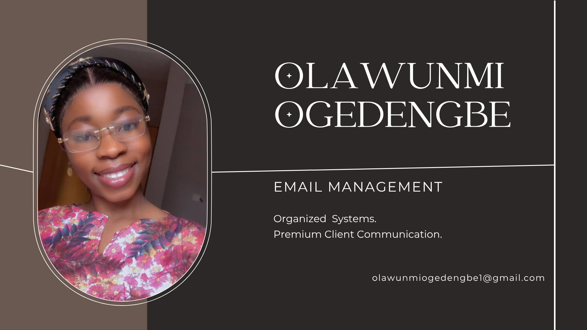

# Email-Management-System

A structured email management system for organizing, prioritizing, and responding to client emails effectively.
This project demostrates how I organise and manage client emails efficiently.

##  What this includes:
- 📁 inbox organization
- 🏷️ Email labeling structure
- 📝 Response templates
- ⚡ Priority handling method
 
##  Tools used:
| Tool | Purpose |
| :--- | :--- |
| **Gmail** | Primary hub for inbox organization and labeling. |
| **Google Docs** | Drafting and refining professional response templates. |
| **Google Drive** | Secure storage for workflows and documentation. |

##  Goal:
To improve response time, reduce clutter, and maintain professional communication with clients.
## 📁 Attached Files:
- [📄 View Email Organization System (PDF)](email-organization-system.pdf)
- [📄 View Email templates (PDF)](email-templates.pdf)
- [📄 View Email workflow (PDF)](email-workflow.pdf)
---

## 📧 Get in Touch
If you're looking for a virtual assistant to help organize your systems or need support with data analysis, I'd love to connect!

* 💼 **LinkedIn:** [Olawunmi Ogedengbe](www.linkedin.com/in/olawunmi-ogedengbe-05b79b331)
* 📬 **Email:** olawunmiogedengbe1@gmail.com

